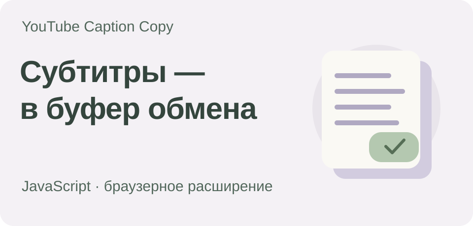

# YouTube Caption Copy

[](https://github.com/Zireael-web/youtube-caption-copy/actions/workflows/tests.yml)

Браузерное расширение, которое копирует доступные субтитры текущего видео YouTube в буфер обмена — обычным текстом, без таймкодов и скачивания файлов.

[Установка](#локальная-установка) · [Возможности](#возможности) · [Приватность](#разрешения-и-приватность) · [Разработка](#разработка)

**JavaScript · Manifest V3 · Chrome & Brave**

Расширение работает локально в активной вкладке. Для него не нужны отдельный аккаунт или внешний backend; в нём нет аналитики и функции скачивания файлов. Интерфейс — на русском языке.

Для меня это практический frontend-проект: интерфейс, работа с DOM и браузерными API на чистом JavaScript.

## Возможности

- Показывает исходные и автоматические субтитры, а также переводы YouTube, если они доступны в плеере.
- Копирует обычный текст без таймкодов, нумерации и названия видео.
- Начинает работать только после запуска пользователем для текущей вкладки.
- Хранит текст субтитров и адреса дорожек только в памяти на время активной сессии.
- Не требует сборки или дополнительных зависимостей для работы.

## Локальная установка

1. Клонируйте или скачайте репозиторий в папку, которую не планируете удалять или перемещать.
2. Откройте `chrome://extensions` в Chrome или `brave://extensions` в Brave.
3. Включите **Режим разработчика** (Developer mode).
4. Нажмите **Загрузить распакованное расширение** (Load unpacked) и выберите папку `extension`, в которой лежит `manifest.json`.
5. Закрепите расширение на панели браузера, откройте видео YouTube и нажмите на значок расширения. Выберите дорожку субтитров и нажмите **Копировать текст**.

После изменения исходников перезагрузите расширение на странице расширений браузера, а затем обновите вкладку YouTube.

## Разрешения и приватность

| Разрешение | Для чего нужно |
| --- | --- |
| `activeTab` | Даёт временный доступ к текущей вкладке после запуска расширения пользователем. |
| `scripting` | Открывает панель и получает сведения о субтитрах из активного плеера YouTube. |
| `clipboardWrite` | Записывает выбранный текст субтитров в буфер обмена по нажатию пользователя. |

Расширение не запрашивает разрешения `downloads` и `clipboardRead`. Оно не читает содержимое буфера обмена, не сохраняет постоянную историю, не отправляет субтитры на внешние сервисы и не обращается к собственному серверу расширения.

Данные субтитров поступают из активной вкладки YouTube и обрабатываются в памяти. Для запросов YouTube могут понадобиться параметры, сформированные его плеером. В этом проекте они не зашиты в код, не сохраняются и не передаются отдельному сервису.

## Ограничения

- Можно скопировать только субтитры, которые YouTube предоставляет для текущего видео. Расширение не распознаёт речь.
- Работа с прямыми эфирами, Shorts, видео с ограничениями доступа и видео без субтитров не гарантируется.
- Изменения плеера или внутренних интерфейсов YouTube могут потребовать доработки кода.
- Пользователь отвечает за соблюдение прав на контент и применимых правил платформы.

Проект не связан с Google или YouTube, не одобрен ими и не получает от них спонсорской поддержки.

## Разработка

Node.js 20 или новее нужен только для запуска проверок и тестов.

```sh
npm test
npm run check
```

- `extension/page-api.js` получает доступные дорожки и текст субтитров из YouTube.
- `extension/core.js` преобразует субтитры JSON3 или XML в обычный текст.
- `extension/panel.js` отображает панель и записывает текст в буфер обмена.
- `extension/background.js` связывает запуск расширения с обменом сообщениями между вкладкой и расширением.
- `tests/` содержит автоматические тесты и локальную браузерную страницу для проверки на синтетических данных.

Чтобы открыть браузерную тестовую страницу, выполните команду из корня репозитория и перейдите по адресу `http://127.0.0.1:8765/tests/browser.html`.

```sh
python3 -m http.server 8765 --bind 127.0.0.1
```

## О проекте

Я сделал этот pet-проект для себя: хотелось быстро получать текст субтитров без лишних файлов. Заодно изучал разработку браузерных расширений — ещё одну область применения frontend-навыков.

Обложка — иллюстрация идеи проекта, а не скриншот интерфейса.

## Лицензия

Лицензия для репозитория пока не выбрана. Публичный доступ сам по себе не даёт разрешения на повторное использование кода.
