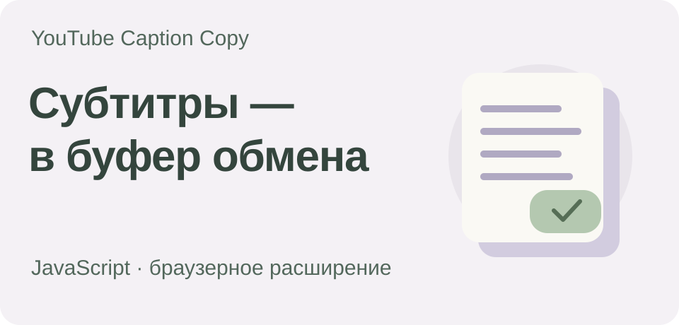

# YouTube Caption Copy

**English** | [Русский](README.ru.md)

[](https://github.com/Zireael-web/youtube-caption-copy/actions/workflows/tests.yml)

A browser extension that copies the available captions of the current YouTube video to the clipboard as plain text — no timestamps and no file downloads.

[Install](#local-install) · [Features](#features) · [Privacy](#permissions-and-privacy) · [Development](#development)

**JavaScript · Manifest V3 · Chrome & Brave**

The extension works locally in the active tab. It needs no account and no external backend, and it has no analytics and no download feature. The interface is in Russian.

For me this is a practical frontend project: UI, DOM work and browser APIs in plain JavaScript.

## Features

- Shows original and auto-generated captions, plus YouTube translations when the player offers them.
- Copies plain text without timestamps, numbering or the video title.
- Starts working only after the user launches it for the current tab.
- Keeps caption text and track URLs in memory only, for the active session.
- Needs no build step or extra dependencies to run.

## Local install

1. Clone or download the repository into a folder you do not plan to delete or move.
2. Open `chrome://extensions` in Chrome or `brave://extensions` in Brave.
3. Turn on **Developer mode**.
4. Click **Load unpacked** and select the `extension` folder that contains `manifest.json`.
5. Pin the extension to the toolbar, open a YouTube video and click the extension icon. Pick a caption track and click **Копировать текст** ("Copy text").

A ready-made archive of the `extension` folder is attached to each [release](https://github.com/Zireael-web/youtube-caption-copy/releases/latest): unzip it and load that folder the same way.

After changing the sources, reload the extension on the browser's extensions page and then refresh the YouTube tab.

## Permissions and privacy

| Permission | Why it is needed |
| --- | --- |
| `activeTab` | Grants temporary access to the current tab after the user launches the extension. |
| `scripting` | Opens the panel and reads caption information from the active YouTube player. |
| `clipboardWrite` | Writes the selected caption text to the clipboard when the user clicks. |

The extension does not request the `downloads` or `clipboardRead` permissions. It does not read the clipboard, keeps no persistent history, never sends captions to external services and has no server of its own.

Caption data comes from the active YouTube tab and is processed in memory. YouTube requests may need parameters generated by its player. This project does not hard-code, store or forward them to any separate service.

## Limitations

- Only captions that YouTube provides for the current video can be copied. The extension does not recognize speech.
- Live streams, Shorts, restricted videos and videos without captions are not guaranteed to work.
- Changes to the YouTube player or its internal interfaces may require code updates.
- Users are responsible for respecting content rights and the platform's rules.

The project is not affiliated with, endorsed by or sponsored by Google or YouTube.

## Development

Node.js 20 or newer is needed only to run checks and tests.

```sh
npm test
npm run check
```

- `extension/page-api.js` fetches the available tracks and caption text from YouTube.
- `extension/core.js` converts JSON3 or XML captions to plain text.
- `extension/panel.js` renders the panel and writes text to the clipboard.
- `extension/background.js` connects the extension launch with messaging between the tab and the extension.
- `tests/` holds the automated tests and a local browser page for checks on synthetic data.

To open the browser test page, run this from the repository root and go to `http://127.0.0.1:8765/tests/browser.html`:

```sh
python3 -m http.server 8765 --bind 127.0.0.1
```

## About

I built this side project for myself: I wanted caption text quickly, without extra files. Along the way I learned browser extension development — one more place to use frontend skills.

The cover is an illustration of the project idea, not a screenshot of the interface.

## License

[MIT](LICENSE)
